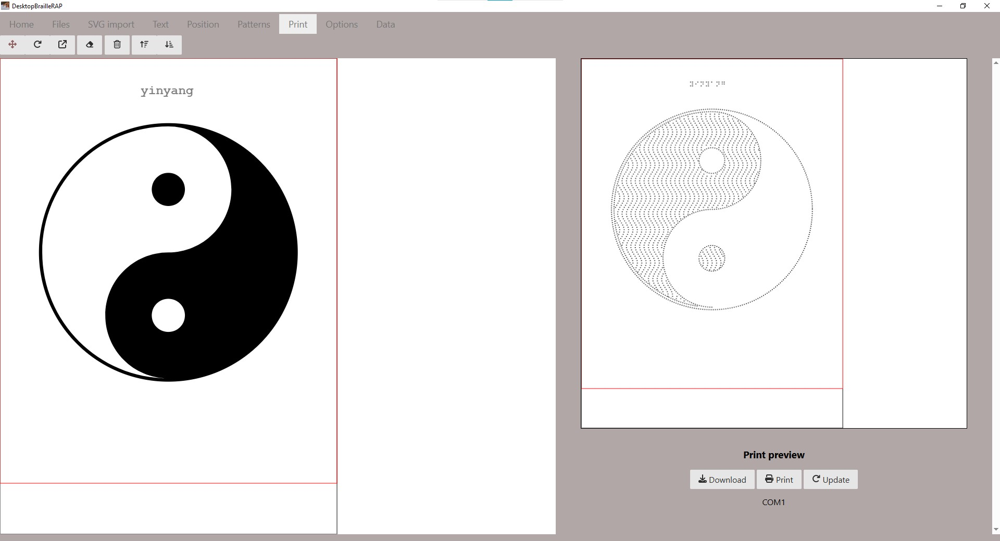
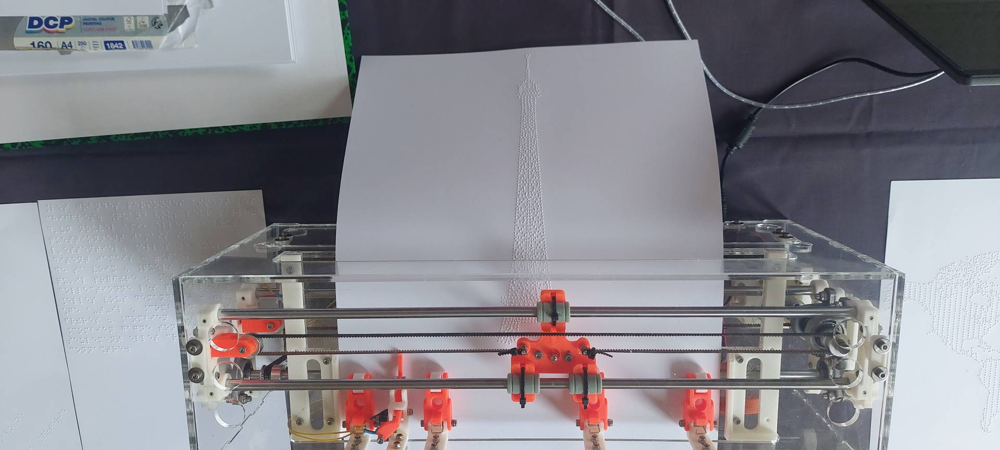
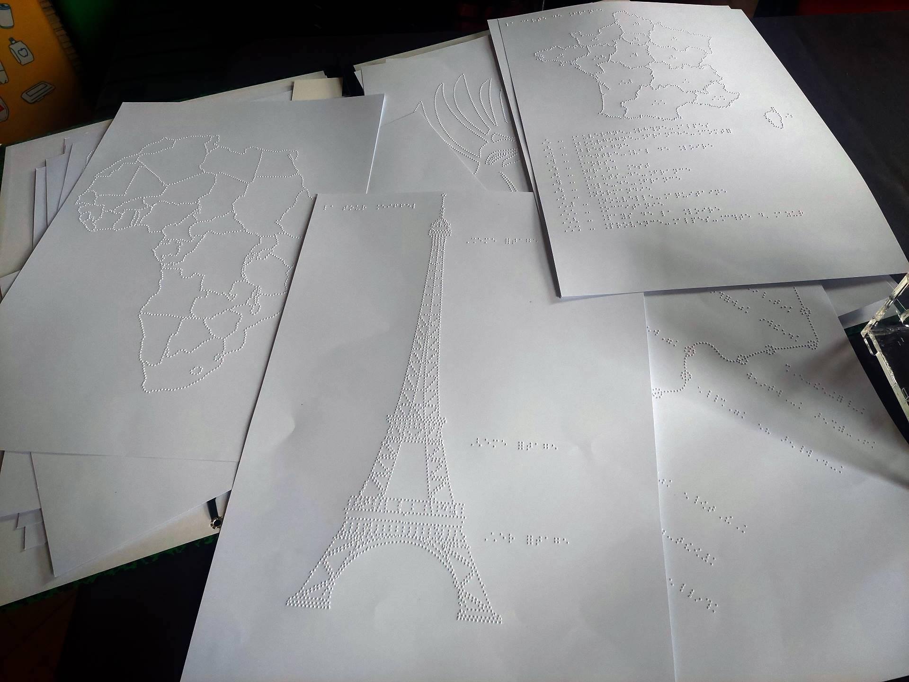

# DesktopBrailleRAP

Document authoring tool for [BrailleRAP](https://github.com/braillerap/BrailleRap) allowing to mix svg vector graphics with Braille to build tangible documents.


*A screenshot of DesktopBrailleRAP with svg vector and Braille text*


*A screenshot of DesktopBrailleRAP using patter filling with vector graphics*


*A BrailleRAP embosser "printing" a tangible representation of the Eiffel tower in Paris*


*Some examples of tangible documents made on BrailleRAP with DesktopBrailleRAP*

## Features

* SVG import
* Build tangible sketch from svg by printing Braille dots along vector graphic Path
* Add text label anywhere on the page layout
* Text to Braille conversion. The Braille conversion is done with [liblouis](https://github.com/liblouis/liblouis).
* Scale, rotate and move any element on the page layout.
* Associate filling or stroke color to patterns of Braille dots.
* Associate line color to patterns of Braille dots.
* Display a print preview.
* Direct print to BrailleRAP embosser.
* GCODE download for hacking and test.
* Multi locales GUI.

we just start a wiki about DesktopBrailleRAP [here](https://github.com/braillerap/DesktopBrailleRAP/wiki)

# Releases
We provide pre-built binaries for Windows, Debian 12, Ubuntu 24.04 and Raspberry PI OS. See [releases](https://github.com/BrailleRAP/DesktopBrailleRAP/releases) for more information.

DesktopBrailleRAP depends on glibc version. Unfortunately recent Debian and Ubuntu distribution are not using exactly the same. 
If your are using Debian 12 or a derivate distribution, use desktopbraillerap-debian. 
If you are using Ubuntu 24.04 or a derivate distribution, use desktopbraillerap-ubuntu

To use the BrailleRAP embosser from Linux, the user need permission to use the serial port. This generaly mean that your user need to be in the **dialout** group.

[](https://github.com/braillerap/DesktopBrailleRAP/actions/workflows/auto_build_for_ubuntu.yml)


[](https://github.com/braillerap/DesktopBrailleRAP/actions/workflows/auto_build_for_debian.yml)

## User manual
The user manual is available [https://desktopbraillerap.readthedocs.io/en/latest/](https://desktopbraillerap.readthedocs.io/en/latest/)

There is also wiki about DesktopBrailleRAP [here](https://github.com/braillerap/DesktopBrailleRAP/wiki)

**en** [](https://desktopbraillerap.readthedocs.io/en/latest/)

**fr** [](https://desktopbraillerap.readthedocs.io/fr/latest/)


## Contributing

### Translation
If you need the software in your locale language, we will be happy to add a new translation. Translation files are hosted on codeberg community translation platform and can be updated by anyone [weblate host on codeberg](https://translate.codeberg.org/projects/desktopbraillerap_translate/ihm/) for more information.


### Code and features
Feel free to open issues or pull requests ! We will be happy to review and merge your changes. BTW we have a great focus on accessibility and user friendly design.

## Translations status

### Software GUI
Translation files are available [on codeberg weblate host](https://translate.codeberg.org/projects/desktopbraillerap_translate/ihm/) . Some languages are partialy translated , we are looking for contributors to complete and check them.     


<a href="https://translate.codeberg.org/engage/desktopbraillerap_translate/">

</a>

### User manual
User manual translation files are available [on codeberg weblate host](https://translate.codeberg.org/projects/desktopbraillerap_doc/) . Some languages are partialy translated , we are looking for contributors to complete and check them.    

<a href="https://translate.codeberg.org/engage/desktopbraillerap_doc/">

</a>

## Funding

This project is funded through [NGI0 Entrust](https://nlnet.nl/entrust), a fund established by [NLnet](https://nlnet.nl) with financial support from the European Commission's [Next Generation Internet](https://ngi.eu) program. Learn more at the [NLnet project page](https://nlnet.nl/project/BrailleRAP).

[](https://nlnet.nl)
[](https://nlnet.nl/entrust)


# Building on Windows

## Prerequisites

* Python 3.6 or later
* NodeJS 20.12 or later

## Create a python virtual environment

```
python -m venv venv
```

## Activate python virtual environment

```
.\venv\Scripts\activate
```

## Install python dependencies

```
pip install -r requirements.txt
```

## Install nodejs dependencies

```
npm install
```

## Run in dev environement

```
npm run startview
```

## Build windows .exe

```
npm run buildview
```
check DesktopBrailleRAP.exe in dist folder


# Building on Linux

## Prerequisites
We need several development tools to build DesktopBrailleRAP, python, nodejs and gcc to build some python dependencies.
Depending on your system, you will also need a desktop environment installed on the build machine.


### Python / gcc / nodejs

General build tools:

    apt install  cmake build-essential git ninja-build autoconf gnulib
    apt install  ca-certificates curl gnupg
    apt install  software-properties-common
    apt install  python3 python3-venv python3-dev
    apt install  pkg-config 
    apt install  gir1.2-gtk-3.0 gir1.2-webkit2-4.1
    apt install  python3-tk 
    apt install  xvfb
    apt install  libcairo2 libcairo2-dev libgirepository1.0-dev
    apt install  tcl curl

Nodejs:

General Nodejs
    
    curl -sL https://deb.nodesource.com/setup_20.x | bash -
    apt update
    apt install -y nodejs
    npm i npm@latest -g

Install DesktopBrailleRAP nodejs dependencies

    npm install

Python:

Create a python3 virtual environment

    python3 -m venv venv

Activate python3 virtual environment

    source ./venv/bin/activate

Install python3 DesktopBrailleRAP dependencies

    pip install -r requirement_linux.txt

## Build DesktopBrailleRAP

Activate python virtual env 

    source ./venv/bin/activate

### Run in development environement

    npm run startview

### Build DesktopBrailleRAP

    npm run builddebian

Check the ./dist folder for the desktopbraillerap-debian executable. You can install the .deb package with:

    sudo dpkg -i desktopbraillerap-debian-x.x.x.deb


# Building for Raspberry PI 4

## Prerequisites
The packaged  binary release has been build on a Raspberry 4 2GO with latest 64 bits Raspberry PI OS (debian bookworm)

Raspberry PI OS come with python, we only need to istall nodejs and some python dependicies. We love to use virtual env on python, but the needed python packages are not available has wheel packages on arm (packages for pip cmd), so we must install the python dependencies in the global system configuration.

### build tools
    
    sudo apt install git-extras

### Python

    sudo apt install python3-gi python3-gi-cairo gir1.2-gtk-3.0 gir1.2-webkit2-4.1
    sudo apt install python3-pyqt5 python3-pyqt5.qtwebengine python3-pyqt5.qtwebchannel 
    sudo apt install libqt5webkit5-dev

### Install nodejs
    curl -sL https://deb.nodesource.com/setup_20.x | bash -
    apt update
    apt install -y nodejs
    npm i npm@latest -g

### Create python environnement

    python3 -m venv venv --system-site-packages

### install nodejs dependencies

    npm i

### activate virtualenv

    source ./venv/bin/activate

### install python dependencies in virtualenv

    pip install pywebview
    pip install pyserial
    pip install pyinstaller

### Run in development environement

    npm run startview

### build DesktopBrailleRAP

    npm run buildrpi

Check the dist folder for desktopbraillerap-rpi executable. You can install the .deb package with :

    sudo apt install desktopbraillerap-rpi-x.x.x.deb

# Building for Linux using Docker
You can use Docker configuration to build DesktopBrailleRAP for a Linux distribution. 

Docker configuration to build DesktopBrailleRAP for Debian or Ubuntu are available here:

[Debian](https://github.com/braillerap/BuildDesktopBrailleRAPDebian)

[Ubuntu](https://github.com/braillerap/BuildDesktopBrailleRAPLinux)
