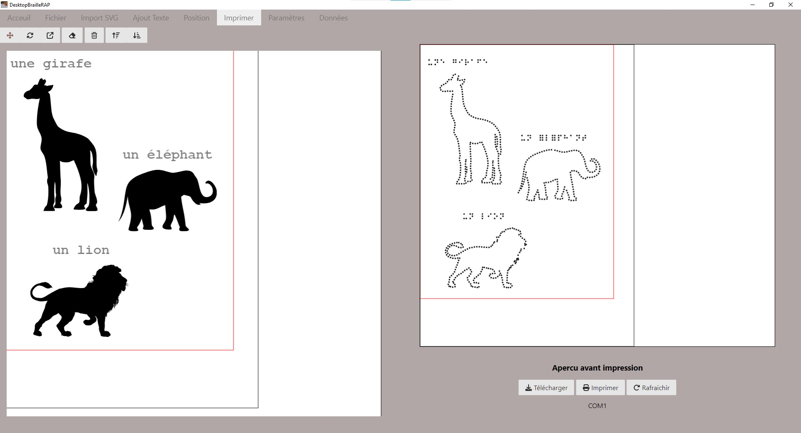
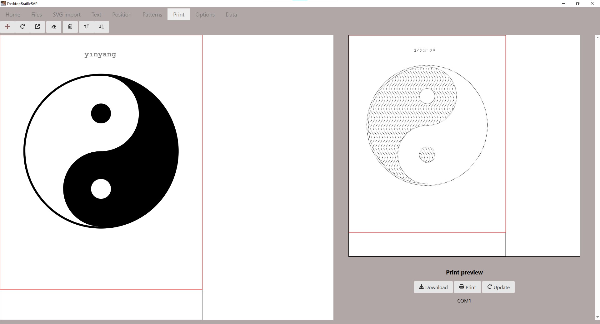
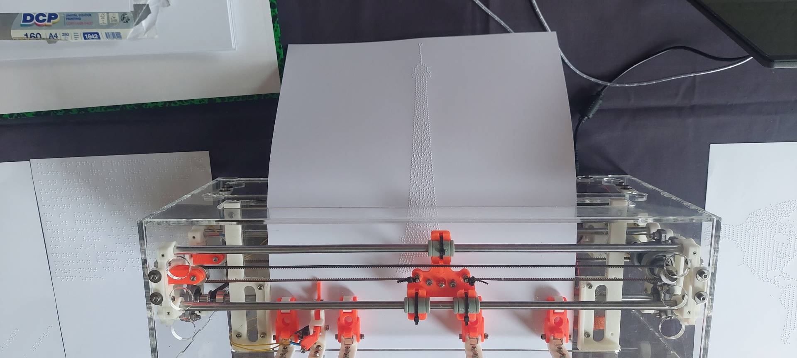
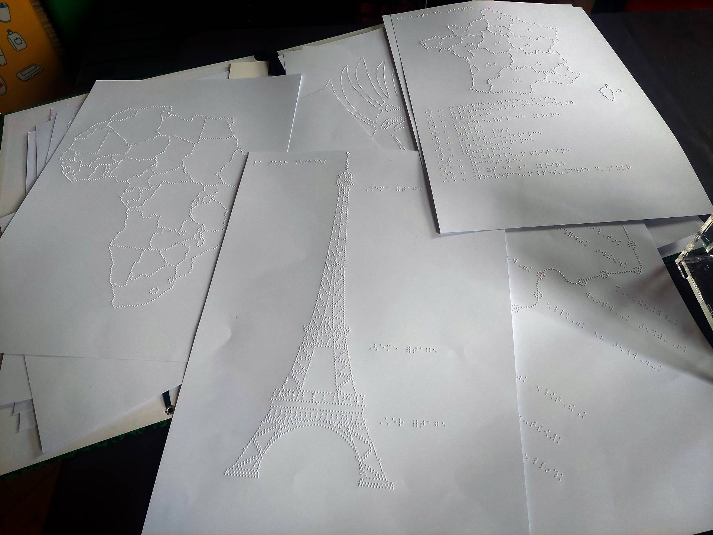

# DesktopBrailleRAP

Document authoring tool for [BrailleRAP](https://github.com/braillerap/BrailleRap) allowing to mix svg vector graphics with Braille to build tangible documents.

*A screenshot of DesktopBrailleRAP with svg vector and Braille text*

*A screenshot of DesktopBrailleRAP using pattern filling with vector graphics*

*A BrailleRAP embosser "printing" a tangible representation of the Eiffel tower in Paris*

*Some examples of tangible documents made on BrailleRAP with DesktopBrailleRAP*

## Features

* SVG import
* Build tangible sketch from svg by printing Braille dots along vector graphic Path
* Add text label anywhere on the page layout
* Text to Braille conversion. The Braille conversion is done with [liblouis](https://github.com/liblouis/liblouis).
* Scale, rotate and move any element on the page layout.
* Associate filling or stroke color to patterns of Braille dots.
* Associate line color to patterns of Braille dots.
* Display a print preview.
* Direct print to BrailleRAP embosser.
* GCODE download for hacking and test.
* Multi locales GUI.
* Automation using environment variables.

we just start a wiki about DesktopBrailleRAP [here](https://github.com/braillerap/DesktopBrailleRAP/wiki)

# Releases
We provide pre-built binaries for Windows, Debian 12,  Debian 13, Ubuntu 24.04 and Raspberry PI OS. See [releases](https://github.com/BrailleRAP/DesktopBrailleRAP/releases) for more information.

DesktopBrailleRAP depends on glibc version. Unfortunately recent Debian and Ubuntu distribution are not using exactly the same. 
If your are using Debian 12 or a derivate distribution, use desktopbraillerap-debian. 
If your are using Debian 13 or a derivate distribution, use desktopbraillerap-debian13. 
If you are using Ubuntu 24.04 or a derivate distribution, use desktopbraillerap-ubuntu

To use the BrailleRAP embosser from Linux, the user need permission to use the serial port. This generaly mean that your user need to be in the **dialout** group.

## User manual
The user manual is available [https://desktopbraillerap.readthedocs.io/en/latest/](https://desktopbraillerap.readthedocs.io/en/latest/)

There is also wiki about DesktopBrailleRAP [here](https://github.com/braillerap/DesktopBrailleRAP/wiki)

**en** 

**fr** 

## Contributing

### Translation
If you need the software in your locale language, we will be happy to add a new translation. Translation files are hosted on codeberg community translation platform and can be updated by anyone [weblate host on codeberg](https://translate.codeberg.org/projects/desktopbraillerap_translate/ihm/) for more information.

### Code and features
Feel free to open issues or pull requests ! We will be happy to review and merge your changes. BTW we have a great focus on accessibility and user friendly design.

## Translations status

### Software GUI
Translation files are available [on codeberg weblate host](https://translate.codeberg.org/projects/desktopbraillerap_translate/ihm/) . Some languages are partialy translated , we are looking for contributors to complete and check them.     

### User manual
User manual translation files are available [on codeberg weblate host](https://translate.codeberg.org/projects/desktopbraillerap_doc/) . Some languages are partialy translated , we are looking for contributors to complete and check them.    

## Funding

This project is funded through [NGI0 Entrust](https://nlnet.nl/entrust), a fund established by [NLnet](https://nlnet.nl) with financial support from the European Commission's [Next Generation Internet](https://ngi.eu) program. Learn more at the [NLnet project page](https://nlnet.nl/project/BrailleRAP).

## Building from source for Windows, Linux or Raspberry

  You will find a [comprehensive building manual](DETAILED_INSTALLATION_BRAILLERAP.md) for various systems. 
