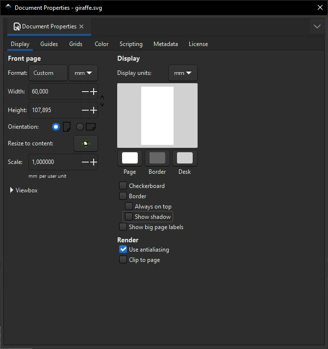
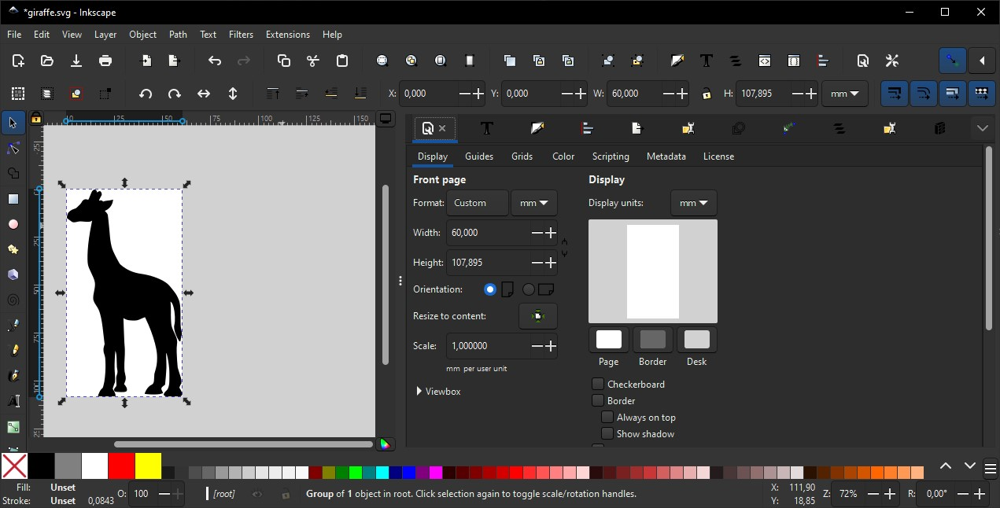

# Conseils pour la réalisation de documents

## Utiliser les mm comme unité pour les SVG

Pour eviter d'avoir des rapports d'echelles trop grand ou trop petit, il est recommandé d'utiliser les millimètres comme unité pour les SVG. En effet, les mm sont une unité de mesure qui permet d'avoir des rapports d'echelles plus homogènes que les pixels. Le deuxième avantage c'est que vous pourrez evaluer la taille des objets en mm sur votre document.

Pour utiliser ou convertir un svg en mm, vous pouvez utiliser le logiciel [Inkscape](https://inkscape.org).

Toujours dans Inkscape, de préférence on conservera une echelle (scale) de 1.00, et il est intéressant de redimensionner le document SVG à la taille du graphique qu'il contient avec le bouton "Redimensionner à la taille du contenu" (Resize to content).

Cette méthode vous permettra de réaliser plus efficacement vos documents en préparant des graphiques de tailles connus. Dans l'exemple qui suit vous pouvez constater que la girafe fait 60 mm de large et 107mm de haut, ces dimensions seront conservées par DesktopBrailleRAP, la girafe embossée sera également de la même taille sur le papier.

