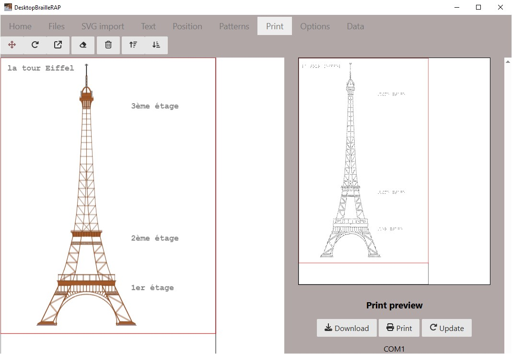

# Conseils pour la réalisation de documents

## Utiliser les mm comme unité pour les SVG

Pour eviter d'avoir des rapports d'echelles trop grand ou trop petit, il est recommandé d'utiliser les millimètres comme unité pour les SVG. En effet, les mm sont une unité de mesure qui permet d'avoir des rapports d'echelles plus homogènes que les pixels. Le deuxième avantage c'est que vous pourrez evaluer la taille des objets en mm sur votre document.

Pour utiliser ou convertir un svg en mm, vous pouvez utiliser le logiciel [Inkscape](https://inkscape.org).

Toujours dans Inkscape, de préférence on conservera une echelle (scale) de 1.00, et il est intéressant de redimensionner le document SVG à la taille du graphique qu'il contient avec le bouton "Redimensionner à la taille du contenu" (Resize to content).

Cette méthode vous permettra de réaliser plus efficacement vos documents en préparant des graphiques de tailles connus et facile à manipuler avec DesktopBrailleRAP. Dans l'exemple qui suit vous pouvez constater que la girafe fait 60 mm de large et 107 mm de haut, ces dimensions seront conservées par DesktopBrailleRAP, la girafe embossée sera également de la même taille sur le papier.

## Réaliser des documents "simples"

Il n'y a pas de limites à ce que vous pouvez réaliser avec DesktopBrailleRAP, mais il est recommandé de réaliser des documents simples et clairs pour faciliter la lecture par les personnes mal-voyantes. 

Voici quelques conseils pour réaliser des documents simples :
- Eviter les contours qui se croisent
- Eviter de multiplier les textures
- Si vous souhaiter que les textures representent des éléments différents, utiliser plutot des textures espacées. 
- Les textures resserées sont plus confortable à lire.
- Supprimer les détails qui ne sont pas utiles à la compréhension du documents.
- Tester les documents avec les personnes concernées.

## Exemple de réalisations testées avec des mal-voyants

Voici quelques exemples de documents testés avec des mal-voyants, ces documents ont été réalisés avec DesktopBrailleRAP.

Un exemple de fichier trop complexe est le suivant. Visuellement on a bien l'impression de rendre ledécor des ailes du papillon, malheureusement avec les doigts le remplissage est trop complexe et nuit à la lecture et donc la comprehension du contour des ailes.

