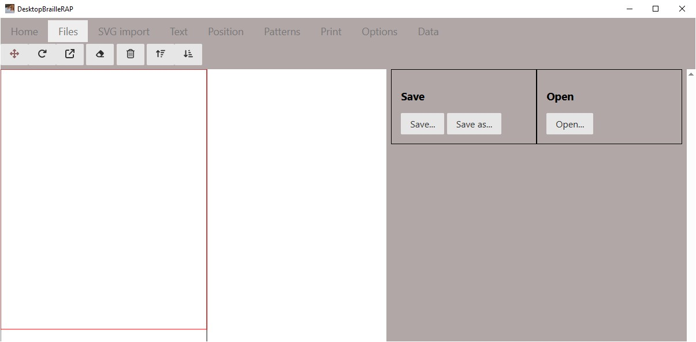

# Tour d'horizon des fonctions de DesktopBrailleRAP

## Les options du menu principal

### Acceuil
Affiche une page d'information sur le logiciel.

### Fichiers
Affiche les options relatives à l'enregistrement ou la lecture d'un fichier contenant une composition (extension .brp)

### Import SVG
Afficher les options relatives à l'importation d'un fichier SVG

### Texte
Affiche les options relatives à l'ajout de bloc texte

### Position
Afficher les options relatives à la position,l'orientation ou l'échelle des graphiques et des blocs de texte.

### Motif
Affiche les options relatives à l'association de motif à une couleur de remplissage ou une couleur de ligne

### Imprimer
Afficher un aperçu avant impression ainsi que les options pour imprimer le document sur une BrailleRAP.

### Paramètres
Affiche les options relatives à la configuration du logiciel.

### Données
Affiche un résumé de la composition active.

## Fichiers  

### Introduction
L'action de cliquer sur l'option affiche une page relative a l'enregistrement ou la lecture d'un fichier composition (extension .brp).

### Bouton *Enregistrer*
Enregistre la composition active en utilisant le nom de fichier actif.

### Bouton *Enregistrer sous...*
Enregistre la composition active en demandant le nom du fichier a l'aide de la boîte de dialogue de sélection de fichier.

### Bouton *Ouvrir*
Ouvre le fichier composition sélectionné en demandant le nom du fichier a l'aide de la boîte de dialogue de sélection de fichier.

## Import SVG

### Introduction

L'action de cliquer sur l'option "Import SVG" permet d'importer un fichier SVG dans la composition. Le fichier SVG est importé en tant que bloc et pourra être déplacé, redimensionné, réorienté, supprimé.

### Bouton *Importer*
Le bouton "Importer" affiche la boîte de dialogue de sélection de fichier. Sélectionnez le fichier SVG que vous souhaitez intégrer à la composition et cliquer sur le bouton "Ouvrir". Le fichier SVG est importé en tant que bloc et apparait dans la composition sur la partie gauche de la page.

