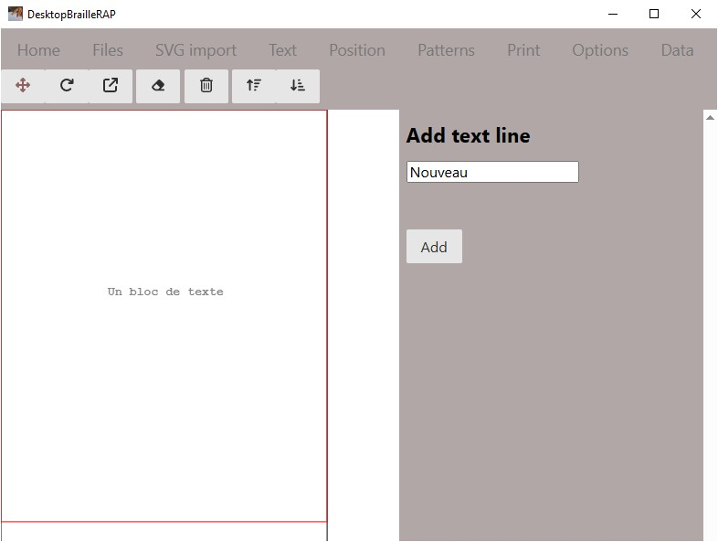
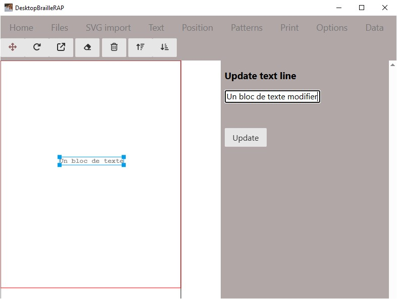
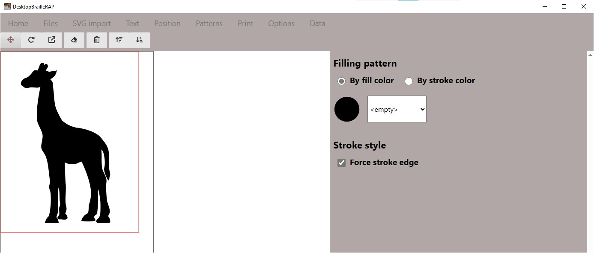
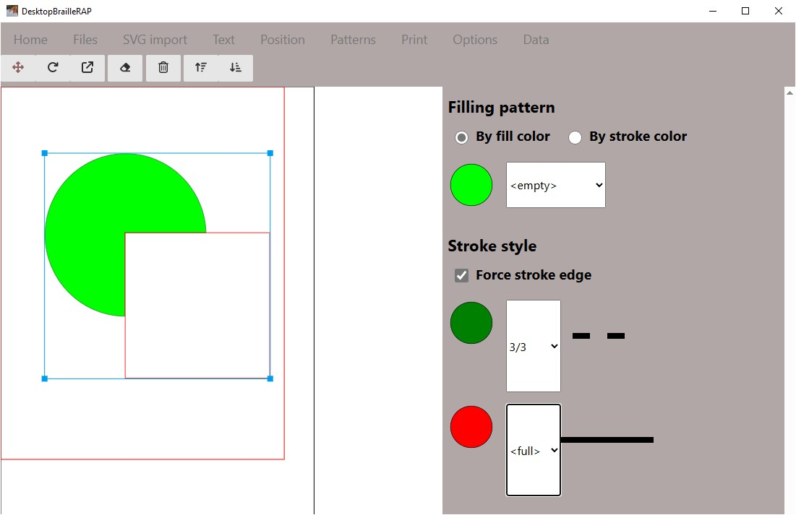
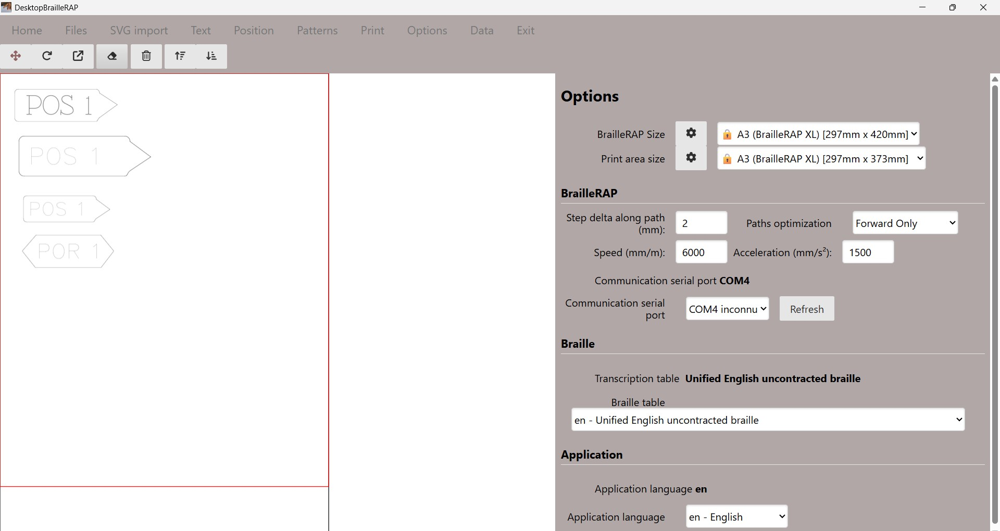
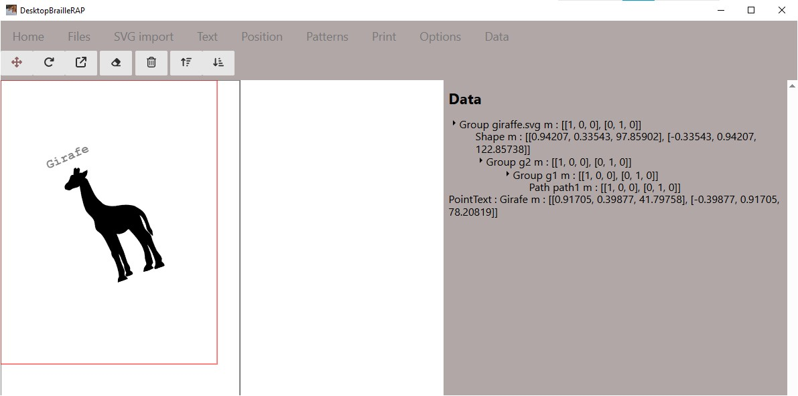

# Tour d'horizon des fonctions de DesktopBrailleRAP

## Les options du menu principal

### Acceuil
Affiche une page d'information sur le logiciel.

### Fichiers
Affiche les options relatives à l'enregistrement ou la lecture d'un fichier contenant une composition (extension .brp)

### Import SVG
Afficher les options relatives à l'importation d'un fichier SVG

### Texte
Affiche les options relatives à l'ajout de bloc texte

### Position
Afficher les options relatives à la position,l'orientation ou l'échelle des graphiques et des blocs de texte.

### Motif
Affiche les options relatives à l'association de motif à une couleur de remplissage ou une couleur de ligne

### Imprimer
Afficher un aperçu avant impression ainsi que les options pour imprimer le document sur une BrailleRAP.

### Paramètres
Affiche les options relatives à la configuration du logiciel.

### Données
Affiche un résumé de la composition active.

## Fichiers  

### Introduction
L'action de cliquer sur l'option affiche une page relative a l'enregistrement ou la lecture d'un fichier composition (extension .brp).

### Bouton *Enregistrer*
Enregistre la composition active en utilisant le nom de fichier actif.

### Bouton *Enregistrer sous...*
Enregistre la composition active en demandant le nom du fichier a l'aide de la boîte de dialogue de sélection de fichier.

### Bouton *Ouvrir*
Ouvre le fichier composition sélectionné en demandant le nom du fichier a l'aide de la boîte de dialogue de sélection de fichier.

## Import SVG

### Introduction

L'action de cliquer sur l'option "Import SVG" permet d'importer un fichier SVG dans la composition. Le fichier SVG est importé en tant que bloc et pourra être déplacé, redimensionné, réorienté, supprimé.

### Bouton *Importer*
Le bouton "Importer" affiche la boîte de dialogue de sélection de fichier. Sélectionnez le fichier SVG que vous souhaitez intégrer à la composition et cliquer sur le bouton "Ouvrir". Le fichier SVG est importé en tant que bloc et apparait dans la composition sur la partie gauche de la page.

## Texte

### Introduction
L'action de cliquer sur le menu "Texte" affiche une page relative a la création d'un bloc de texte.

### Bouton *Ajouter*
Le bouton *Ajouter* permet d'ajouter un bloc de texte dans le document. Le texte est ajouté sous forme d'un bloc sur la visualisation de la page dans la partie gauche. Ce bloc de texte peut être déplacé et orienté. Au moment de l'impression, le texte sera transcrit en Braille. Les blocs de texte ne sont pas redimensionables, parce que le Braille est toujours de taille unique.

### Bouton *Modifier*
En sélectionnant un bloc de texte dans la visualisation sur la partie gauche, vous pouvez modifier le texte en le modifiant dans la zone de saisie et en utilisant le bouton *Modifier*

## Position

### Introduction
L'action de cliquer sur le menu "Texte" affiche une page relative a la modification de la position des blocs.

### Utilisation
Sélectionner un bloc dans la visualisation sur la partie gauche. Le formulaire à droite affiche alors la position du bloc sur la page, sa taille, son orientation (angle) et son echelle en %.

### Position
Après avoir sélectionné un bloc dans la partie gauche, entrer une nouvelle position dans les champs "X" et "Y" puis utiliser le bouton *Fixer la position* pour déplacer le bloc à la position voulue.

### Angle
Après avoir sélectionné un bloc dans la partie gauche, entrer une nouvelle position dans le champ *Angle* puis utiliser le bouton *Fixer l'Angle* pour orienter le bloc suivant l'angle souhaité.

### Echelle
Après avoir sélectionné un bloc dans la partie gauche, entrer une nouvelle echelle en % dans le champ *Echelle* puis utiliser le bouton *Fixer l'Echelle* pour modifier la taille du bloc.

## Motifs

### Introduction
L'action de cliquer sur le menu "Motifs" affiche une page relative a l'association de motifs tactiles avec une couleur de remplissage ou une couleur de contour.

### Utilisation

#### Motifs de remplissage
Les motifs de de remplissage sont utilisés pour remplir de large zone du dessin, de façon imagée, les motifs de remplissage vont remplacer les couleurs de remplissage du dessin.
Vous pouvez choisir une sélection par *couleur de contour* ou par *couleur de remplissage*.
En fonction de la sélection, le formulaire affiche la liste des couleurs utilisées dans la composition. Pour chaque couleur, vous pouvez choisir un motif tactile à associer.

A tout moment, vous pouvez visualiser le résultat de votre sélection en cliquant sur le bouton *Imprimer* du menu supérieur.

#### Motifs de contour
Les motifs de contour sont utilisés pour dessiner des contours de forme, de façon imagée, les motifs de contour vont remplacer les couleurs de contour du dessin.

Par défaut l'option *Forcer les contours* est sélectionnée, cela signifie que si les formes contenu dans le graphique SVG n'ont pas de contour, DesktopBrailleRAP créera un contour plein pour l'impression tactile. C'est ce qui se passe sur l'image de la Girafe dans l'exemple plus haut. Si sur le même example, on enlève l'option *Forcer les contours*, le motif de remplissage est conservé, mais il n'y a plus de contour extérieur sur la girafe.

Par contre, si les forme contenue dans le graphique SVG possède des contours de couleur, la liste des couleurs utilisées est alors affichée dans le formulaire. Pour chaque couleur, vous pouvez choisir un motif tactile de ligne à associer.

Encore une fois, vous pouvez visualiser le résultat de votre sélection en cliquant sur le bouton *Imprimer* du menu supérieur.

## Imprimer

### Introduction
L'action de cliquer sur le menu *Imprimer* affiche une page relative a l'association de motifs tactiles avec une couleur de remplissage ou une couleur de contour.

### Télécharger
Le bouton *Télécharger* permet d'enregistrer la liste des commandes GCODE dans un fichier. Ce fichier GCODE pourra ensuite être utilisé avec une BrailleRAP pour embosser la composition. Ceci permet notamment de modifier le fichier de commandes GCODE manuelement a des fins de tests ou de personnalisation.	

### Imprimer
Le bouton *Imprimer* permet d'envoyer la liste des commandes GCODE a une BrailleRAP connectée avec cable USB pour embosser la composition visible dans la partie "aperçu avant impression".

### Rafraichir
Le bouton *Rafraichir* permet de rafraichir l'aperçu avant impression. C'est utile si vous avez modifié la composition dans la partie gauche de l'interface.

## Options

### Introduction
L'action de cliquer sur le menu *Options* affiche une page relative au paramétrage des différentes options de l'application : Taille du papier, standard Braille, langue de l'application ...

### Section *Taille du papier*

#### Largeur Papier (mm)
cette valeur designe la largeur du papier utilisé. 
Pour une BrailleRAP cette valeur est en génèrale fixée a 210 mm (A4). Pour une BrailleRAP XL cette valeur est en génèrale fixée a 297 mm (A3).

#### Hauteur Papier (mm)
cette valeur designe la hauteur du papier utilisé.
Pour une BrailleRAP cette valeur est en génèrale fixée a 297 mm (A4). Pour une BrailleRAP XL cette valeur est en génèrale fixée a 420 mm (A3).

#### Largeur utile (mm)
Cette valeur désigne la largeur du papier réellement utilisable pour l'embossage. Cette valeur est en génèrale fixée a 190 mm pour une BrailleRAP et a 297 mm pour une BrailleRAP XL.

#### Hauteur utile (mm)
Cette valeur désigne la hauteur du papier réellement utilisable pour l'embossage. Cette valeur est en génèrale fixée a 260 mm pour une BrailleRAP et a 380 mm pour une BrailleRAP XL.

### Section BrailleRAP

#### Distance entre points sur les chemins (mm)
Cette valeur désigne la distance **minimale** entre deux points lors de l'embossage des graphiques. Cette valeur est en génèrale fixée a 2.4 mm. Vous pouvez augmentez ou diminuer cette valeur pour rapprocher ou écarter les points sur les graphiques. Ce paramètre n'a aucune incidence sur l'écartement des **points Braille**.

#### Optimisation pour matériaux facile
Cette option permet d'optimiser l'embossage des graphiques pour les matériaux faciles. 
Si l'option n'est pas activée on s'interdit de faire reculer le papier dans la BrailleRAP lors de l'embossage. Ceci évite des aller/retours qui peuvent être à l'origine de décalage quand on utilise des matériaux "glissant" comme le plastique ou le métal.
Si l'option est activée on autorise le recul du papier dans la BrailleRAP lors de l'embossage. Ceci permet d'optimiser légérement le parcours du pointeau Braille sur la feuille et permet d'aller plus vite.

#### Vitesse (mm/s)
Cette valeur désigne la vitesse de déplacement maximale du pointeau Braille et du papier. Suivant la précision de la mécanique, les drivers moteurs utilisés la référence de la carte électronique, et la nature du support embossé, vous pouvez modifier ces réglages.

Pour les matériaux difficiles et glissant, on utilisera plutôt une vitesse basse entre 800 et 1500 mm/s.
Pour du papier, avec un controleur 8 bits (MKS GEN L) et des drivers 8825 vous pouvez monter jusqu'a 6000 mm/s.

#### Accélération (mm/s²)
Cette valeur désigne l'accélération maximale du pointeau Braille et du papier. Suivant la précision de la mécanique, les drivers moteurs utilisés la référence de la carte électronique, et la nature du support embossé, vous pouvez modifier ces réglages.

Pour les matériaux difficiles et glissant, on utilisera plutôt une accélération basse entre 1000 et 2000 mm/s².
Pour du papier, avec un controleur 8 bits, une mécanique irréprochable et des drivers TMC vous pouvez monter jusqu'a 8000 mm/s².

#### Port de communication
Cette valeur désigne le port de communication utilisé pour la communication avec la BrailleRAP. Si vous avez branché la BrailleRAP après le lancement du logiciel, vous pouvez rafraichir la liste des ports de communication disponible en utilisant le bouton *Actualiser*.

### Section Braille

#### Table Braille
Cette section permet de définir le standard utilisé pour la transcription du texte en Braille. **Attention** il existe parfois plusieurs standard Braille pour la même langue (3 en Français par exemple) et ce paramêtres est indépendant de la langue de l'interface. Vous pouvez par exemple utiliser DesktopBrailleRAP en Français et transcrire le Braille au standard Anglais si les lecteurs du document utilisent ce standard Braille.

### Section Application

#### Langue de l'application
Cette valeur désigne la langue utilisée pour l'interface de l'application. Elle n'a aucune incidence sur la transcription du texte en Braille.

## Données

### Introduction
L'action de cliquer sur le menu *Données* affiche une page relative a l'affichage des données de la composition. Vous y trouverez un affichage sous forme d'arbre qui reprend l'ensemble des élements de la composition.

