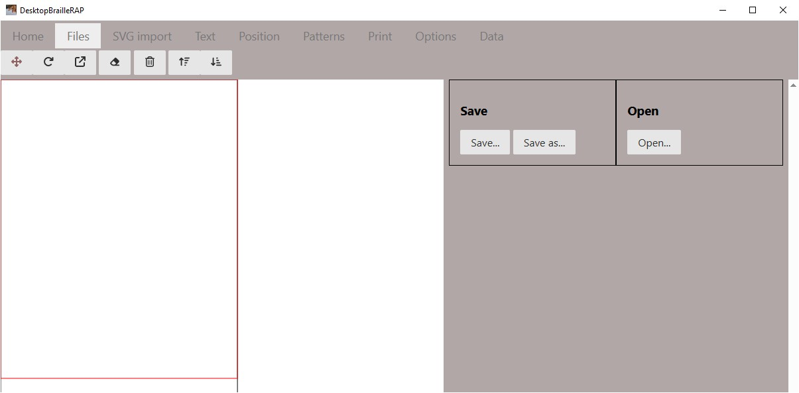
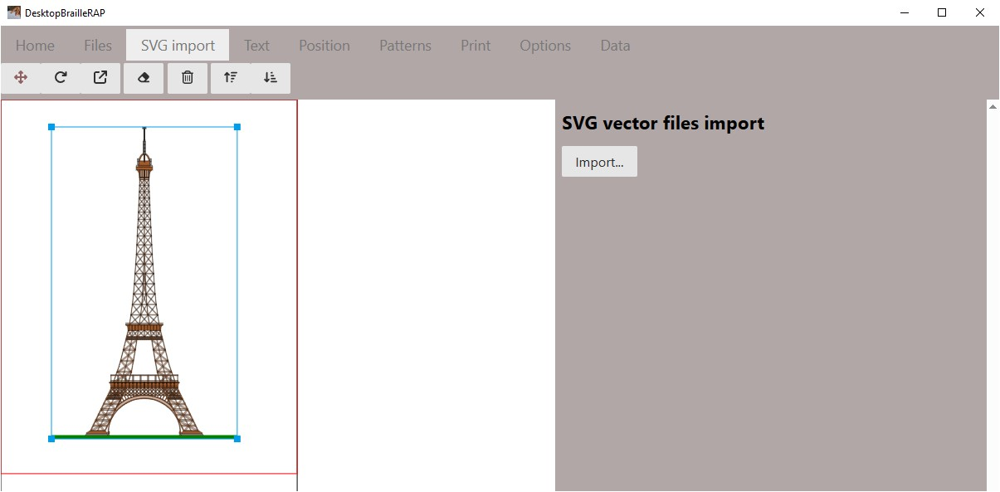
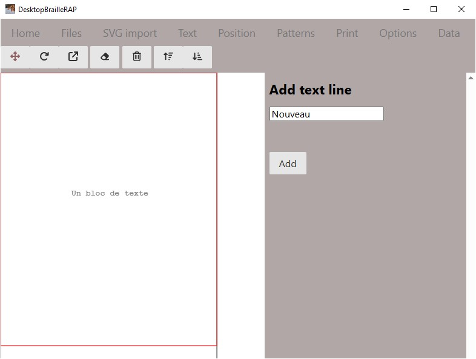
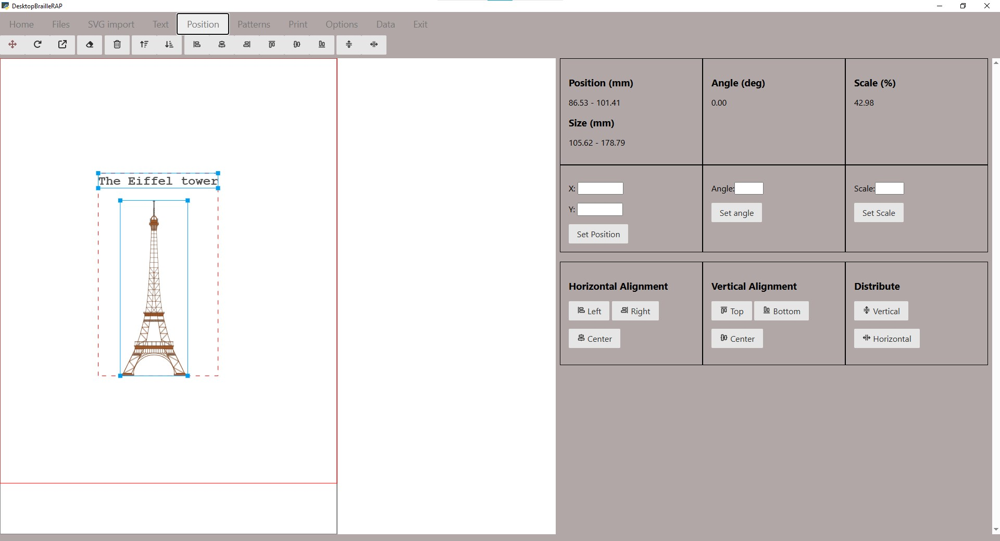
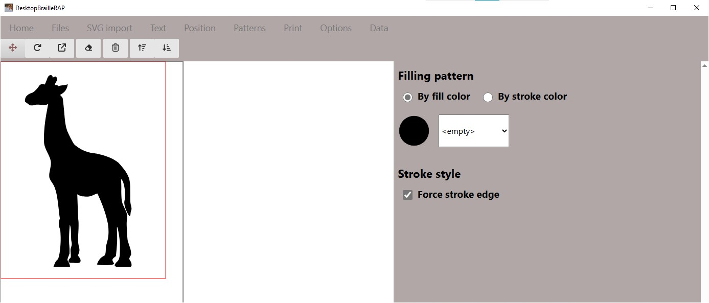
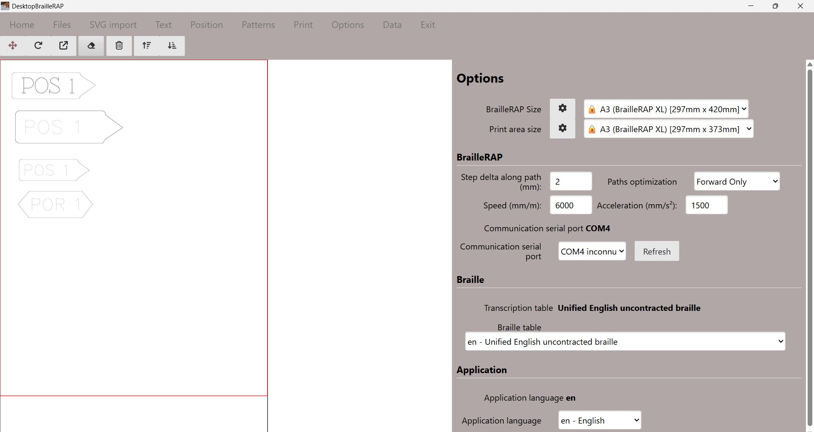

# Fonctionalités

## Les principales fonctionnalités de DesktopBrailleRAP sont:
- Importer des images au format SVG
- Ajouter des blocs d'annotation en Braille
- Déplacer, orienter, redimensionner les graphiques importés.
- Déplacer, orienter les blocs d'annotation en Braille.
- Sauvegarder une composition.
- Charger une composition.
- Attribuer des motifs de points Braille pour le remplissage des aplats de couleurs.
- Attribuer des motifs de lignes à des couleurs de lignes.
- Embosser (imprimer) une composition sur une BrailleRAP connectée en USB.

# Tour d'horizon des fonctions de DesktopBrailleRAP

## Les options du menu principal

### Accueil
Affiche une page d'information sur le logiciel.

### Fichiers
Affiche les options relatives à l'enregistrement ou la lecture d'un fichier contenant une composition (extension .brp)

### Import SVG
Afficher les options relatives à l'importation d'un fichier SVG

### Texte
Affiche les options relatives à l'ajout de bloc texte

### Position
Afficher les options relatives à la position,l'orientation ou l'échelle des graphiques et des blocs de texte.

### Motif
Affiche les options relatives à l'association de motif à une couleur de remplissage ou une couleur de ligne

### Imprimer
Afficher un aperçu avant impression ainsi que les options pour imprimer le document sur une BrailleRAP.

### Paramètres
Affiche les options relatives à la configuration du logiciel.

### Données
Affiche un résumé de la composition active.