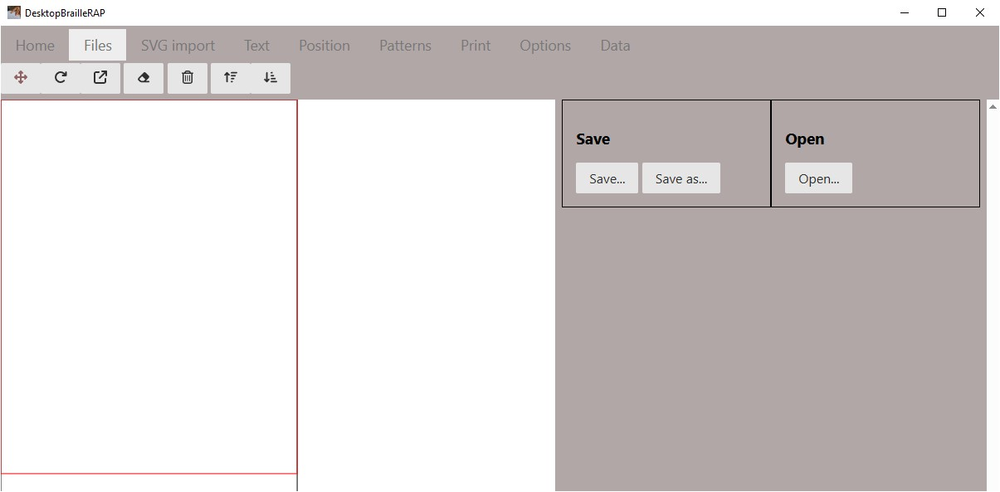

# Fichiers

## Introduction
L'action de cliquer sur l'option affiche une page relative a l'enregistrement ou la lecture d'un fichier composition (extension .brp).

## Bouton *Enregistrer*
Enregistre la composition active en utilisant le nom de fichier actif.

## Bouton *Enregistrer sous...*
Enregistre la composition active en demandant le nom du fichier a l'aide de la boîte de dialogue de sélection de fichier.

## Bouton *Ouvrir*
Ouvre le fichier composition sélectionné en demandant le nom du fichier a l'aide de la boîte de dialogue de sélection de fichier.

