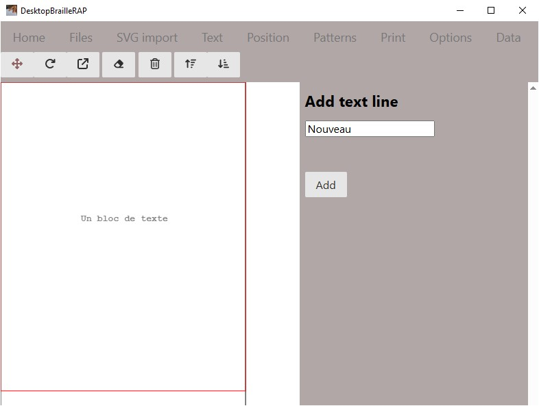
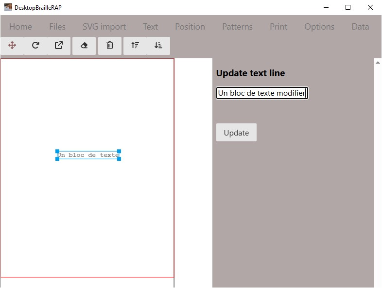

# Texte

## Introduction
L'action de cliquer sur le menu "Texte" affiche une page relative a la création d'un bloc de texte.

## Bouton *Ajouter*
Le bouton *Ajouter* permet d'ajouter un bloc de texte dans le document. Le texte est ajouté sous forme d'un bloc sur la visualisation de la page dans la partie gauche. Ce bloc de texte peut être déplacé et orienté. Au moment de l'impression, le texte sera transcrit en Braille. Les blocs de texte ne sont pas redimensionables, parce que le Braille est toujours de taille unique.

## Bouton *Modifier*
En sélectionnat un bloc de text dans la visualisation sur la partie gauche, vous pouvez modifier le texte en le modifiant dans la zone de saisie et en utilisant le bouton *Modifier*

