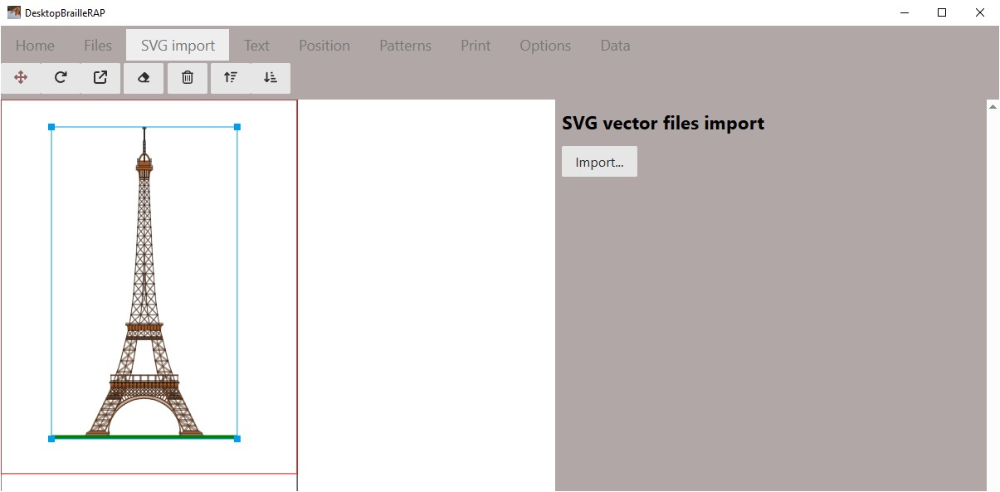

# Import SVG

## Introduction

L'action de cliquer sur l'option "Import SVG" permet d'importer un fichier SVG dans la composition. Le fichier SVG est importé en tant que bloc et pourra être déplacé, redimensionné, réorienté, supprimé.

## Bouton *Importer*
Le bouton "Importer" affiche la boîte de dialogue de sélection de fichier. Sélectionnez le fichier SVG que vous souhaitez intégrer à la composition et cliquer sur le bouton "Ouvrir". Le fichier SVG est importé en tant que bloc et apparait dans la composition sur la partie gauche de la page.

