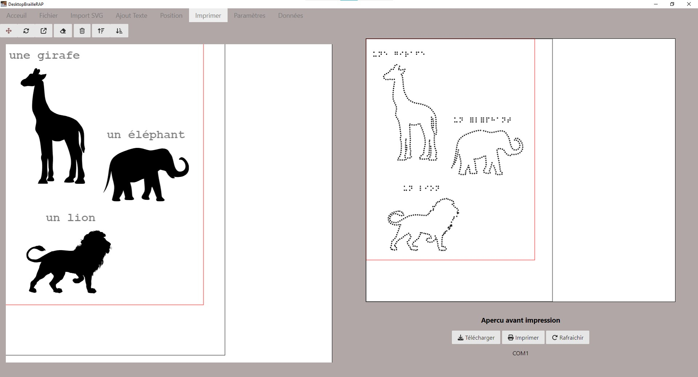
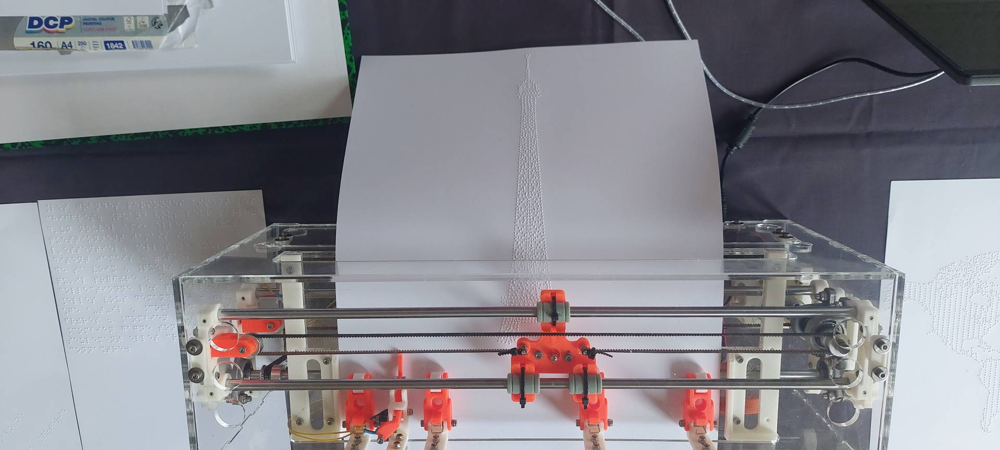

# Introduction

DesktopBrailleRAP est un outil de composition de page destiné a réaliser des documents tactiles embossés sur une embosseuse BrailleRAP. Pour rappel BrailleRAP est une embosseuse DIY (Do It Yourself) open source permettant de réaliser des documents en Braille.

 
 
