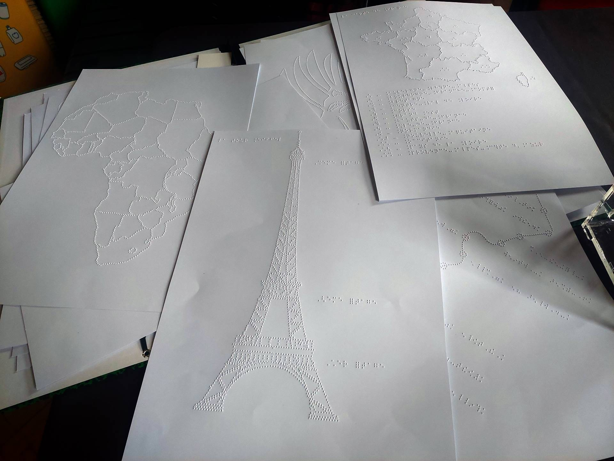

Introduction
============

**DesktopBrailleRAP** est un outil de composition de page destiné a réaliser des documents tactiles embossés sur une embosseuse **BrailleRAP**. Par documents tactiles on entend des documents qui contiennent des graphiques mis en relief, avec des annotations en Braille. Pour rappel **BrailleRAP** est une embosseuse DIY (Do It Yourself) open source permettant de réaliser des documents en Braille.

Par exemple:

Une BrailleRAP XL à Gauche, Une BrailleRAP standard à droite
 

