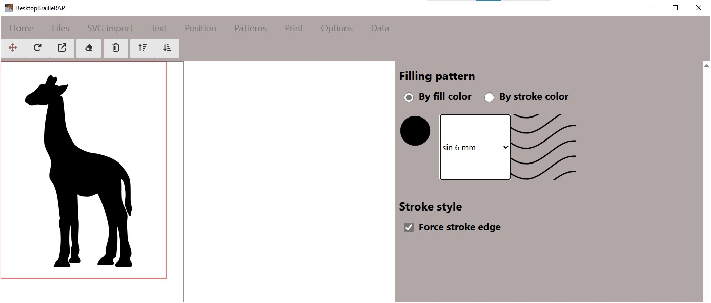

# Motifs

## Introduction
L'action de cliquer sur le menu "Motifs" affiche une page relative a l'association de motifs tactiles avec une couleur de remplissage ou une couleur de contour.

## Utilisation

### Motifs de remplissage
Les motifs de de remplissage sont utilisés pour remplir de large zone du dessin, de façon imagée, les motifs de remplissage vont remplacer les couleurs de remplissage du dessin.
Vous pouvez choisir une sélection par *couleur de contour* ou par *couleur de remplissage*.
En fonction de la sélection, le formulaire affiche la liste des couleurs utilisées dans la composition. Pour chaque couleur, vous pouvez choisir un motif tactile à associer.

A tout moment, vous pouvez visualiser le résultat de votre sélection en cliquant sur le bouton *Imprimer* du menu supérieur.

### Motifs de contour
Les motifs de contour sont utilisés pour dessiner des contours de forme, de façon imagée, les motifs de contour vont remplacer les couleurs de contour du dessin.

Par défaut l'option *Forcer les contours* est sélectionnée, cela signifie que si les formes contenu dans le graphique SVG n'ont pas de contour, DesktopBrailleRAP créera un contour plein pour l'impression tactile. C'est ce qui se passe sur l'image de la Girafe dans l'exemple plus haut. Si sur le même example, on enlève l'option *Forcer les contours*, le motif de remplissage est conservé, mais il n'y a plus de contour extérieur sur la girafe.

Par contre, si les forme contenue dans le graphique SVG possède des contours de couleur, la liste des couleurs utilisées est alors affichée dans le formulaire. Pour chaque couleur, vous pouvez choisir un motif tactile de ligne à associer.

Encore une fois, vous pouvez visualiser le résultat de votre sélection en cliquant sur le bouton *Imprimer* du menu supérieur.

