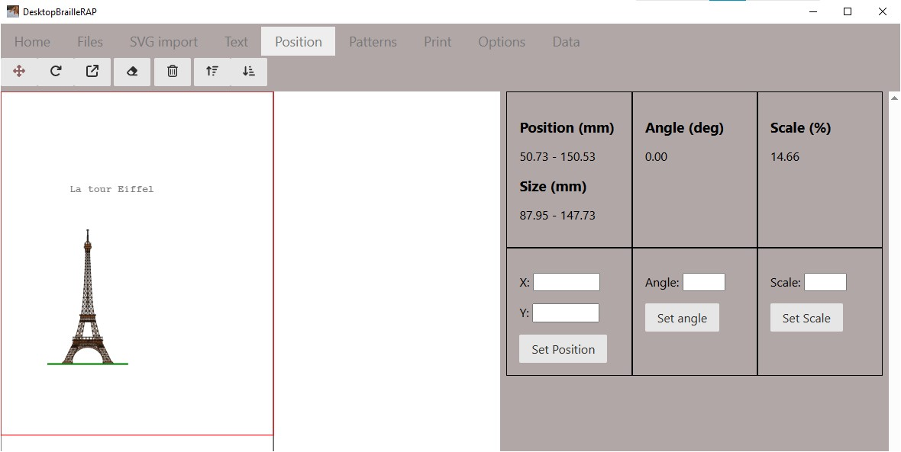
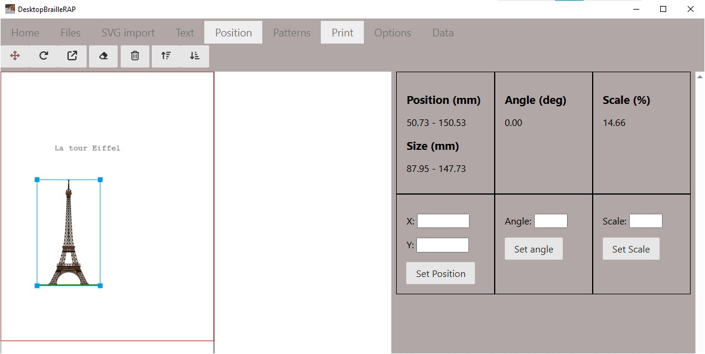
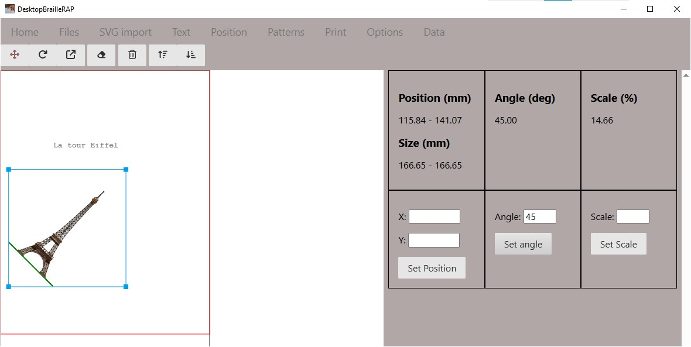

# Position

## Introduction
L'action de cliquer sur le menu "Texte" affiche une page relative a la modification de la position des blocs.

## Utilisation
Sélectionner un bloc dans la visualisation sur la partie gauche. Le formulaire à droite affiche alors la position du bloc sur la page, sa taille, son orientation (angle) et son echelle en %.

## Position
Après avoir sélectionné un bloc dans la partie gauche, entrer une nouvelle position dans les champs "X" et "Y" puis utiliser le bouton *Fixer la position* pour déplacer le bloc à la position voulue.

## Angle
Après avoir sélectionné un bloc dans la partie gauche, entrer une nouvelle position dans le champ *Angle* puis utiliser le bouton *Fixer l'Angle* pour orienter le bloc suivant l'angle souhaité.

## Echelle
Après avoir sélectionné un bloc dans la partie gauche, entrer une nouvelle echelle en % dans le champ *Echelle* puis utiliser le bouton *Fixer l'Echelle* pour modifier la taille du bloc.

