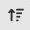
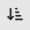

# La barre d'outils

## Introduction
La barre d'outil vous permet à tous moments d'accéder à certaine fonctions avec la souris.

Pour utiliser les commandes de la barre d'outils, sélectionner un bloc de la composition et cliquer sur la commande désirée.

## Fonctions

### Mise en forme de la composition

#### Déplacement des blocs de la composition
La commande  permet de déplacer le bloc sélectionné avec la souris.

La commande  permet de faire pivoté le bloc sélectionné avec la souris.

La commande  permet de modifier la taille du bloc sélectionné avec la souris.

#### Suppression des blocs de la composition
La commande  permet de supprimer le bloc sélectionné.

#### Création d'une nouvelle composition
La commande  permet de créer une nouvelle composition. Attention, toutes les modifications non sauvegardées seront perdues.

#### Avant plan / Arrière plan
Les commandes  et  permettent de déplacer le bloc sélectionné en avant ou en arrière plan.